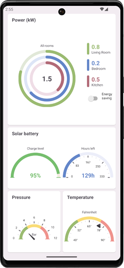

<!-- default badges list -->

[](https://supportcenter.devexpress.com/ticket/details/T1202995)
[](https://docs.devexpress.com/GeneralInformation/403183)
[](#does-this-example-address-your-development-requirementsobjectives)
<!-- default badges end -->

# DevExpress Radial Gauge for .NET MAUI

This example shows how to use the [Radial Gauge](https://docs.devexpress.com/MAUI/404674/radial-gauge) control to create a dashboard panel in a .NET MAUI app. In this example, the dashboard panel shows a set of gauges used to monitor sensors in a smart home.



## Included Controls and Their Properties

* [RadialGauge](https://docs.devexpress.com/MAUI/DevExpress.Maui.Gauges.RadialGauge?p=netframework)

* [DXStackLayout](https://docs.devexpress.com/MAUI/DevExpress.Maui.Core.DXStackLayout): [Orientation](https://docs.devexpress.com/MAUI/DevExpress.Maui.Core.DXStackLayout.Orientation), [ItemSpacing](https://docs.devexpress.com/MAUI/DevExpress.Maui.Core.DXStackLayout.ItemSpacing), [ItemsSource](https://docs.devexpress.com/MAUI/DevExpress.Maui.Core.DXLayoutBase.ItemsSource), [ItemTemplate](https://docs.devexpress.com/MAUI/DevExpress.Maui.Core.DXLayoutBase.ItemTemplate)

* [DXWrapLayout](https://docs.devexpress.com/MAUI/DevExpress.Maui.Core.DXWrapLayout): [ItemAlignment](https://docs.devexpress.com/MAUI/DevExpress.Maui.Core.DXWrapLayout.ItemAlignment), [IsClippedToBounds](https://docs.devexpress.com/MAUI/DevExpress.Maui.Core.DXViewBase.IsClippedToBounds), [Wrap](https://docs.devexpress.com/MAUI/DevExpress.Maui.Core.DXWrapLayout.Wrap), [LineAlignment](https://docs.devexpress.com/MAUI/DevExpress.Maui.Core.DXWrapLayout.LineAlignment), [ItemSpacing](https://docs.devexpress.com/MAUI/DevExpress.Maui.Core.DXWrapLayout.ItemSpacing), [LineSpacing](https://docs.devexpress.com/MAUI/DevExpress.Maui.Core.DXWrapLayout.LineSpacing), [Orientation](https://docs.devexpress.com/MAUI/DevExpress.Maui.Core.DXWrapLayout.Orientation)

* [Label](https://learn.microsoft.com/en-us/dotnet/maui/user-interface/controls/label?view=net-maui-8.0): [Text](https://learn.microsoft.com/en-us/dotnet/api/microsoft.maui.controls.label.text?view=net-maui-8.0)

* [Switch](https://learn.microsoft.com/en-us/dotnet/maui/user-interface/controls/switch?view=net-maui-8.0): [IsToggled](https://learn.microsoft.com/en-us/dotnet/api/microsoft.maui.controls.switch.istoggled?view=net-maui-8.0)


## Implementation Details

1. To add circular gauges to the dashboard page, use the [RadialGauge](https://docs.devexpress.com/MAUI/DevExpress.Maui.Gauges.RadialGauge) component. Add different visual indicators ([MarkerIndicator](https://docs.devexpress.com/MAUI/DevExpress.Maui.Gauges.MarkerIndicator), [NeedleIndicator](https://docs.devexpress.com/MAUI/DevExpress.Maui.Gauges.NeedleIndicator), and [RangeIndicator](https://docs.devexpress.com/MAUI/DevExpress.Maui.Gauges.RangeIndicator)) to a gauge scale ([RadialScale](https://docs.devexpress.com/MAUI/DevExpress.Maui.Gauges.RadialScale)) to track sensor value changes. A gauge can contain multiple scales.

    ```xml
    <dxga:RadialGauge Style="{StaticResource PrimaryGauge}">
        <dxga:RadialScale StartAngle="-90" SweepAngle="360" Fill="#E1E8D8" 
                          Style="{StaticResource NestedScale}" Offset="0" 
                          StrokeCap="Round" EndValue="{Binding MaxLivingRoomPowerConsumption, Mode=OneTime}">
            <dxga:RangeIndicator EndValue="{Binding LivingRoomPowerLevel}" 
                                 Fill="{Binding LivingRoomPowerLevelBrush}" 
                                 StrokeCap="Round"/>
        </dxga:RadialScale>
        <dxga:RadialScale> ... </dxga:RadialScale>
        <dxga:RadialScale> ... </dxga:RadialScale>
    </dxga:RadialGauge>
    ```

2. To add a text label to the center of a gauge, you can define the [RadialGauge.Content](https://docs.devexpress.com/MAUI/DevExpress.Maui.Core.DXBorder.Content) property.

    Use the [OnDisplaySize](https://docs.devexpress.com/MAUI/DevExpress.Maui.Core.OnDisplaySizeExtension?p=netframework) extension to set the font size value depending on the current display size.

    ```xml
    <dxga:RadialGauge Style="{StaticResource PrimaryGauge}">
        <dxga:RadialGauge.Content>
            <Label Style="{StaticResource PrimaryText}" Text="{Binding TotalPowerLevel, StringFormat='{0:F1}'}" FontSize="{dxcr:OnDisplaySize ExtraSmall=14, Small=24}" HorizontalTextAlignment="Center" HorizontalOptions="Center" 
            VerticalOptions="Center" Padding="0"/>
        </dxga:RadialGauge.Content>
    </dxga:RadialGauge>
    ```

4. Use [DXStackLayout](https://docs.devexpress.com/MAUI/404688/layouts/stack-layout) and [DXDockLayout](https://docs.devexpress.com/MAUI/404689/layouts/dock-layout) components to align gauges on the page.

5. This example uses the [DXBorder](https://docs.devexpress.com/MAUI/403983/utility-controls/index#border) control to implement a card styled background for gauges.

    ```xml
    <Style TargetType="dxcr:DXBorder" ApplyToDerivedTypes="False">
        <Setter Property="BackgroundColor" Value="{dxcr:ThemeColor Key=SurfaceContainerLowest}" />
        <Setter Property="CornerRadius" Value="7" />
        <Setter Property="Padding" Value="{dxcr:OnDisplaySize Medium=5, Large=10}" />
        <Setter Property="IsClippedToBounds" Value="False" />
        <Setter Property="Shadow">
            <OnPlatform x:TypeArguments="Shadow">
                <On Platform="iOS">
                    <On.Value>
                        <Shadow Brush="{dxcr:ThemeColor Shadow}"
                                Offset="0,2"
                                Radius="2"
                                Opacity="0.22" />
                    </On.Value>
                </On>
                <On Platform="Android" >
                    <On.Value>
                        <Shadow Brush="{dxcr:ThemeColor Shadow}"
                                Offset="0,4"
                                Radius="2"
                                Opacity="0.15" />
                    </On.Value>
                </On>
            </OnPlatform>
        </Setter>
    </Style>
    ```

6. To create a legend that lists rooms, this example utilizes the [DXStackLayout](https://docs.devexpress.com/MAUI/DevExpress.Maui.Core.DXStackLayout) component. To populate the layout with items, specify the [ItemsSource](https://docs.devexpress.com/MAUI/DevExpress.Maui.Core.DXLayoutBase.ItemsSource) property. The [ItemTemplate](https://docs.devexpress.com/MAUI/DevExpress.Maui.Core.DXLayoutBase.ItemTemplate) property defines item appearance.

    ```xml
    <ContentPage.Resources>
        <ResourceDictionary>
            <DataTemplate x:Key="LegendItem" x:DataType="local:RoomInfo">
                <dxcr:DXStackLayout Orientation="Horizontal" ItemSpacing="8">
                    <dxcr:DXBorder BackgroundColor="{Binding Color}" WidthRequest="8"
                                Margin="0" CornerRadius="4"/>
                    <dxcr:DXStackLayout VerticalOptions="Center" ItemSpacing="-2">
                        <Label Text="{Binding Value, StringFormat='{0:F1}'}" 
                            TextColor="{Binding Color}" 
                            FontAttributes="Bold" 
                            FontSize="20" />
                        <Label Style="{StaticResource SecondaryText}" 
                            FontSize="12" 
                            Text="{Binding Room}" />
                    </dxcr:DXStackLayout>
                </dxcr:DXStackLayout>
            </DataTemplate>
        </ResourceDictionary>
    </ContentPage.Resources>
    <!--...-->
    <dxcr:DXStackLayout ItemsSource="{Binding Rooms}"
                        ItemTemplate="{StaticResource LegendItem}"
                        ItemSpacing="16" />
    ```

## Files to Review

- [MainPage.xaml](./CS/MainPage.xaml)

## Documentation

- [Radial Gauge](https://docs.devexpress.com/MAUI/404674/radial-gauge)
- [Layouts](https://docs.devexpress.com/MAUI/404602/layouts/layouts)
- [Color Themes](https://docs.devexpress.com/MAUI/404636/common-concepts/themes)
- [Featured Scenarios](https://docs.devexpress.com/MAUI/404291/scenarios)

## More Examples

* [DevExpress .NET MAUI Demo Center](https://github.com/DevExpress-Examples/maui-demo-app)
* [Stocks App](https://github.com/DevExpress-Examples/maui-stocks-mini)
* [Data Grid](https://github.com/DevExpress-Examples/maui-data-grid-get-started)
* [Data Form](https://github.com/DevExpress-Examples/maui-data-form-get-started)
* [Data Editors](https://github.com/DevExpress-Examples/maui-editors-get-started)
* [Charts](https://github.com/DevExpress-Examples/maui-charts)
* [Scheduler](https://github.com/DevExpress-Examples/maui-scheduler-get-started)
* [Tab Page](https://github.com/DevExpress-Examples/maui-tab-page-get-started)
* [Tab View](https://github.com/DevExpress-Examples/maui-tab-view-get-started)
* [Drawer Page](https://github.com/DevExpress-Examples/maui-drawer-page-get-started)
* [Drawer View](https://github.com/DevExpress-Examples/maui-drawer-view-get-started)
* [Collection View](https://github.com/DevExpress-Examples/maui-collection-view-get-started)
* [Popup](https://github.com/DevExpress-Examples/maui-popup-get-started)
<!-- feedback -->
## Does this example address your development requirements/objectives?

[](https://www.devexpress.com/support/examples/survey.xml?utm_source=github&utm_campaign=maui-gauges&~~~was_helpful=yes) [](https://www.devexpress.com/support/examples/survey.xml?utm_source=github&utm_campaign=maui-gauges&~~~was_helpful=no)

(you will be redirected to DevExpress.com to submit your response)
<!-- feedback end -->
